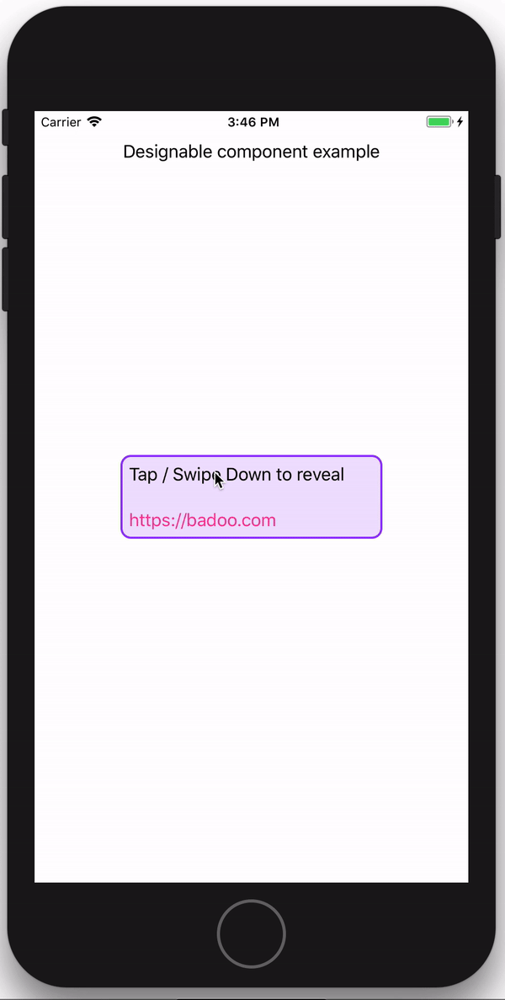
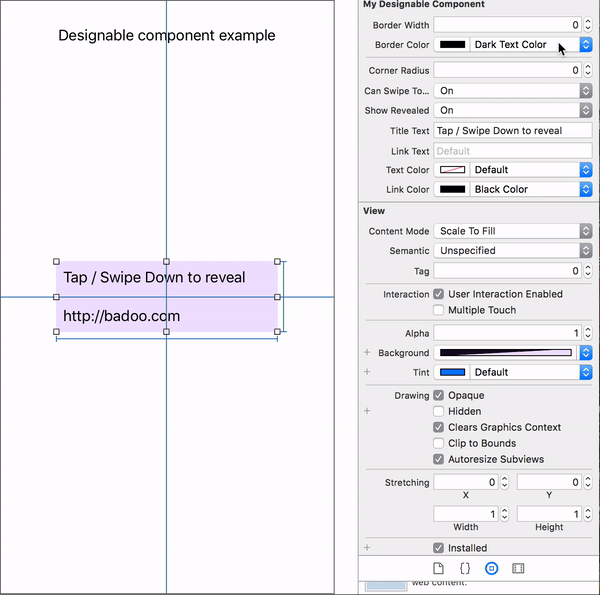

# Designable component example

Example project for custom designable UI component.

For implementation details see the code inside *MyDesignableComponent.swift*.

#### How the component looks:

#### Inside Interface Builder:

